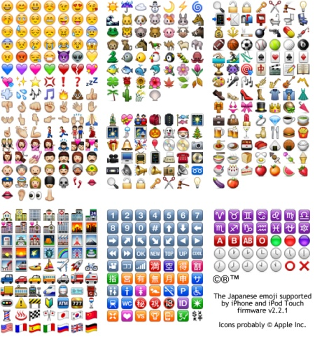

# Apple

Emojipedia now completely documents 
[iPhone OS 2.2.1](https://emojipedia.org/apple/iphone-os-2.2/) and 
[iOS 4.0](https://emojipedia.org/apple/ios-4.0/) emojis,
as well as all newer ones.

## Unicode PUA

For backwards compatibility with legacy content, 
Apple continues to support the original custom codes in the Private Use Area (PUA) of Unicode,
but maps them internally to modern glyphs, 
i.e. there is no way to access previously deviating designs like the _gavel_-like Hammer or the _scallop_-like Spiral Shell. 
The following table is based upon the glyph aliases taken from the iOS 11 AppleColorEmoji.ttf font file. 

The exclusive distribution partner for the first few iPhone models in the Japanese market was [SoftBank](../softbank/), 
so Apple designersclosely followed their precedents and these PUA codes should be compatible as well.
The only legacy emoji supported by Apple that has no modern counterpart is U+E50A, 
showing the iconic [_Shibuya 109_](https://emojipedia.org/emoji/%EE%94%8A/) mall in Tokyo.

| PUA    | Char  | Glyph name | Standard | Emoji    | Glyph name | Variant or note |
| ------ | -------- | ------- | ------- | --------- | ---------- | --------------- |
| U+E001 | &#xE001; | `uE001`	| U+1F466 | &#x1F466; | `u1F466.0` | default skin tone	|
| U+E002 | &#xE002; | `uE002`	| U+1F467 | &#x1F467; | `u1F467.0` | default skin tone	|
| U+E003 | &#xE003; | `uE003`	| U+1F48B | &#x1F48B; | `u1F48B` |	|
| U+E004 | &#xE004; | `uE004`	| U+1F468 | &#x1F468; | `u1F468.0` | default skin tone	|
| U+E005 | &#xE005; | `uE005`	| U+1F469 | &#x1F469; | `u1F469.0` | default skin tone	|
| U+E006 | &#xE006; | `uE006`	| U+1F455 | &#x1F455; | `u1F455` |	|
| U+E007 | &#xE007; | `uE007`	| U+1F45F | &#x1F45F; | `u1F45F` |	|
| U+E008 | &#xE008; | `uE008`	| U+1F4F7 | &#x1F4F7; | `u1F4F7` |	|
| U+E009 | &#xE009; | `uE009`	| U+260E  | &#x260E; | `u260E` |	|
| U+E00A | &#xE00A; | `uE00A`	| U+1F4F1 | &#x1F4F1; | `u1F4F1` |	|
| U+E00B | &#xE00B; | `uE00B`	| U+1F4E0 | &#x1F4E0; | `u1F4E0` |	|
| U+E00C | &#xE00C; | `uE00C`	| U+1F4BB | &#x1F4BB; | `u1F4BB` |	|
| U+E00D | &#xE00D; | `uE00D`	| U+1F44A | &#x1F44A; | `u1F44A.0` | default skin tone	|
| U+E00E | &#xE00E; | `uE00E`	| U+1F44D | &#x1F44D; | `u1F44D.0` | default skin tone	|
| U+E00F | &#xE00F; | `uE00F`	| U+261D  | &#x261D; | `u261D.0` | default skin tone	|
| U+E010 | &#xE010; | `uE010`	| U+270A  | &#x270A; | `u270A.0` | default skin tone	|
| U+E011 | &#xE011; | `uE011`	| U+270C  | &#x270C; | `u270C.0` | default skin tone	|
| U+E012 | &#xE012; | `uE012`	| U+270B  | &#x270B; | `u270B.0` | default skin tone	|
| U+E013 | &#xE013; | `uE013`	| U+1F3BF | &#x1F3BF; | `u1F3BF` |	|
| U+E014 | &#xE014; | `uE014`	| U+26F3  | &#x26F3; | `u26F3` |	|
| U+E015 | &#xE015; | `uE015`	| U+1F3BE | &#x1F3BE; | `u1F3BE` |	|
| U+E016 | &#xE016; | `uE016`	| U+26BE  | &#x26BE; | `u26BE` |	|
| U+E017 | &#xE017; | `uE017`	| U+1F3C4 | &#x1F3C4; | `u1F3C4.0.M` | default skin tone man	|
| U+E018 | &#xE018; | `uE018`	| U+26BD  | &#x26BD; | `u26BD` |	|
| U+E019 | &#xE019; | `uE019`	| U+1F41F | &#x1F41F; | `u1F41F` |	|
| U+E01A | &#xE01A; | `uE01A`	| U+1F434 | &#x1F434; | `u1F434` |	|
| U+E01B | &#xE01B; | `uE01B`	| U+1F697 | &#x1F697; | `u1F697` |	|
| U+E01C | &#xE01C; | `uE01C`	| U+26F5  | &#x26F5; | `u26F5` |	|
| U+E01D | &#xE01D; | `uE01D`	| U+2708  | &#x2708; | `u2708` |	|
| U+E01E | &#xE01E; | `uE01E`	| U+1F683 | &#x1F683; | `u1F683` |	|
| U+E01F | &#xE01F; | `uE01F`	| U+1F685 | &#x1F685; | `u1F685` |	|
| U+E020 | &#xE020; | `uE020`	| U+2753  | &#x2753; | `u2753` |	|
| U+E021 | &#xE021; | `uE021`	| U+2757  | &#x2757; | `u2757` |	|
| U+E022 | &#xE022; | `uE022`	| U+2764  | &#x2764; | `u2764` |	|
| U+E023 | &#xE023; | `uE023`	| U+1F494 | &#x1F494; | `u1F494` |	|
| U+E024 | &#xE024; | `uE024`	| U+1F550 | &#x1F550; | `u1F550` |	|
| U+E025 | &#xE025; | `uE025`	| U+1F551 | &#x1F551; | `u1F551` |	|
| U+E026 | &#xE026; | `uE026`	| U+1F552 | &#x1F552; | `u1F552` |	|
| U+E027 | &#xE027; | `uE027`	| U+1F553 | &#x1F553; | `u1F553` |	|
| U+E028 | &#xE028; | `uE028`	| U+1F554 | &#x1F554; | `u1F554` |	|
| U+E029 | &#xE029; | `uE029`	| U+1F555 | &#x1F555; | `u1F555` |	|
| U+E02A | &#xE02A; | `uE02A`	| U+1F556 | &#x1F556; | `u1F556` |	|
| U+E02B | &#xE02B; | `uE02B`	| U+1F557 | &#x1F557; | `u1F557` |	|
| U+E02C | &#xE02C; | `uE02C`	| U+1F558 | &#x1F558; | `u1F558` |	|
| U+E02D | &#xE02D; | `uE02D`	| U+1F559 | &#x1F559; | `u1F559` |	|
| U+E02E | &#xE02E; | `uE02E`	| U+1F55A | &#x1F55A; | `u1F55A` |	|
| U+E02F | &#xE02F; | `uE02F`	| U+1F55B | &#x1F55B; | `u1F55B` |	|
| U+E030 | &#xE030; | `uE030`	| U+1F338 | &#x1F338; | `u1F338` |	|
| U+E031 | &#xE031; | `uE031`	| U+1F531 | &#x1F531; | `u1F531` |	|
| U+E032 | &#xE032; | `uE032`	| U+1F339 | &#x1F339; | `u1F339` |	|
| U+E033 | &#xE033; | `uE033`	| U+1F384 | &#x1F384; | `u1F384` |	|
| U+E034 | &#xE034; | `uE034`	| U+1F48D | &#x1F48D; | `u1F48D` |	|
| U+E035 | &#xE035; | `uE035`	| U+1F48E | &#x1F48E; | `u1F48E` |	|
| U+E036 | &#xE036; | `uE036`	| U+1F3E0 | &#x1F3E0; | `u1F3E0` |	|
| U+E037 | &#xE037; | `uE037`	| U+26EA  | &#x26EA; | `u26EA` |	|
| U+E038 | &#xE038; | `uE038`	| U+1F3E2 | &#x1F3E2; | `u1F3E2` |	|
| U+E039 | &#xE039; | `uE039`	| U+1F689 | &#x1F689; | `u1F689` |	|
| U+E03A | &#xE03A; | `uE03A`	| U+26FD  | &#x26FD; | `u26FD` |	|
| U+E03B | &#xE03B; | `uE03B`	| U+1F5FB | &#x1F5FB; | `u1F5FB` |	|
| U+E03C | &#xE03C; | `uE03C`	| U+1F3A4 | &#x1F3A4; | `u1F3A4` |	|
| U+E03D | &#xE03D; | `uE03D`	| U+1F3A5 | &#x1F3A5; | `u1F3A5` |	|
| U+E03E | &#xE03E; | `uE03E`	| U+1F3B5 | &#x1F3B5; | `u1F3B5` |	|
| U+E03F | &#xE03F; | `uE03F`	| U+1F511 | &#x1F511; | `u1F511` |	|
| U+E040 | &#xE040; | `uE040`	| U+1F3B7 | &#x1F3B7; | `u1F3B7` |	|
| U+E041 | &#xE041; | `uE041`	| U+1F3B8 | &#x1F3B8; | `u1F3B8` |	|
| U+E042 | &#xE042; | `uE042`	| U+1F3BA | &#x1F3BA; | `u1F3BA` |	|
| U+E043 | &#xE043; | `uE043`	| U+1F374 | &#x1F374; | `u1F374` |	|
| U+E044 | &#xE044; | `uE044`	| U+1F378 | &#x1F378; | `u1F378` |	|
| U+E045 | &#xE045; | `uE045`	| U+2615  | &#x2615; | `u2615` |	|
| U+E046 | &#xE046; | `uE046`	| U+1F370 | &#x1F370; | `u1F370` |	|
| U+E047 | &#xE047; | `uE047`	| U+1F37A | &#x1F37A; | `u1F37A` |	|
| U+E048 | &#xE048; | `uE048`	| U+26C4  | &#x26C4; | `u26C4` |	|
| U+E049 | &#xE049; | `uE049`	| U+2601  | &#x2601; | `u2601` |	|
| U+E04A | &#xE04A; | `uE04A`	| U+2600  | &#x2600; | `u2600` |	|
| U+E04B | &#xE04B; | `uE04B`	| U+2614  | &#x2614; | `u2614` |	|
| U+E04C | &#xE04C; | `uE04C`	| U+1F319 | &#x1F319; | `u1F319` |	|
| U+E04D | &#xE04D; | `uE04D`	| U+1F304 | &#x1F304; | `u1F304` |	|
| U+E04E | &#xE04E; | `uE04E`	| U+1F47C | &#x1F47C; | `u1F47C.0` | default skin tone	|
| U+E04F | &#xE04F; | `uE04F`	| U+1F431 | &#x1F431; | `u1F431` |	|
| U+E050 | &#xE050; | `uE050`	| U+1F42F | &#x1F42F; | `u1F42F` |	|
| U+E051 | &#xE051; | `uE051`	| U+1F43B | &#x1F43B; | `u1F43B` |	|
| U+E052 | &#xE052; | `uE052`	| U+1F436 | &#x1F436; | `u1F436` |	|
| U+E053 | &#xE053; | `uE053`	| U+1F42D | &#x1F42D; | `u1F42D` |	|
| U+E054 | &#xE054; | `uE054`	| U+1F433 | &#x1F433; | `u1F433` |	|
| U+E055 | &#xE055; | `uE055`	| U+1F427 | &#x1F427; | `u1F427` |	|
| U+E056 | &#xE056; | `uE056`	| U+1F60A | &#x1F60A; | `u1F60A` |	|
| U+E057 | &#xE057; | `uE057`	| U+1F603 | &#x1F603; | `u1F603` |	|
| U+E058 | &#xE058; | `uE058`	| U+1F61E | &#x1F61E; | `u1F61E` |	|
| U+E059 | &#xE059; | `uE059`	| U+1F620 | &#x1F620; | `u1F620` |	|
| U+E05A | &#xE05A; | `uE05A`	| U+1F4A9 | &#x1F4A9; | `u1F4A9` |	|
| U+E101 | &#xE101; | `uE101`	| U+1F4EB | &#x1F4EB; | `u1F4EB` |	|
| U+E102 | &#xE102; | `uE102`	| U+1F4EE | &#x1F4EE; | `u1F4EE` |	|
| U+E103 | &#xE103; | `uE103`	| U+1F4E9 | &#x1F4E9; | `u1F4E9` |	|
| U+E104 | &#xE104; | `uE104`	| U+1F4F2 | &#x1F4F2; | `u1F4F2` |	|
| U+E105 | &#xE105; | `uE105`	| U+1F61C | &#x1F61C; | `u1F61C` |	|
| U+E106 | &#xE106; | `uE106`	| U+1F60D | &#x1F60D; | `u1F60D` |	|
| U+E107 | &#xE107; | `uE107`	| U+1F631 | &#x1F631; | `u1F631` |	|
| U+E108 | &#xE108; | `uE108`	| U+1F613 | &#x1F613; | `u1F613` |	|
| U+E109 | &#xE109; | `uE109`	| U+1F435 | &#x1F435; | `u1F435` |	|
| U+E10A | &#xE10A; | `uE10A`	| U+1F419 | &#x1F419; | `u1F419` |	|
| U+E10B | &#xE10B; | `uE10B`	| U+1F437 | &#x1F437; | `u1F437` |	|
| U+E10C | &#xE10C; | `uE10C`	| U+1F47D | &#x1F47D; | `u1F47D` |	|
| U+E10D | &#xE10D; | `uE10D`	| U+1F680 | &#x1F680; | `u1F680` |	|
| U+E10E | &#xE10E; | `uE10E`	| U+1F451 | &#x1F451; | `u1F451` |	|
| U+E10F | &#xE10F; | `uE10F`	| U+1F4A1 | &#x1F4A1; | `u1F4A1` |	|
| U+E110 | &#xE110; | `uE110`	| U+1F340 | &#x1F340; | `u1F340` |	|
| U+E111 | &#xE111; | `uE111`	| U+1F48F | &#x1F48F; | `u1F48F.WM` | woman and man	|
| U+E112 | &#xE112; | `uE112`	| U+1F381 | &#x1F381; | `u1F381` |	|
| U+E113 | &#xE113; | `uE113`	| U+1F52B | &#x1F52B; | `u1F52B` |	|
| U+E114 | &#xE114; | `uE114`	| U+1F50D | &#x1F50D; | `u1F50D` |	|
| U+E115 | &#xE115; | `uE115`	| U+1F3C3 | &#x1F3C3; | `u1F3C3.0.M` | default skin tone man	|
| U+E116 | &#xE116; | `uE116`	| U+1F528 | &#x1F528; | `u1F528` |	|
| U+E117 | &#xE117; | `uE117`	| U+1F386 | &#x1F386; | `u1F386` |	|
| U+E118 | &#xE118; | `uE118`	| U+1F341 | &#x1F341; | `u1F341` |	|
| U+E119 | &#xE119; | `uE119`	| U+1F342 | &#x1F342; | `u1F342` |	|
| U+E11A | &#xE11A; | `uE11A`	| U+1F47F | &#x1F47F; | `u1F47F` |	|
| U+E11B | &#xE11B; | `uE11B`	| U+1F47B | &#x1F47B; | `u1F47B` |	|
| U+E11C | &#xE11C; | `uE11C`	| U+1F480 | &#x1F480; | `u1F480` |	|
| U+E11D | &#xE11D; | `uE11D`	| U+1F525 | &#x1F525; | `u1F525` |	|
| U+E11E | &#xE11E; | `uE11E`	| U+1F4BC | &#x1F4BC; | `u1F4BC` |	|
| U+E11F | &#xE11F; | `uE11F`	| U+1F4BA | &#x1F4BA; | `u1F4BA` |	|
| U+E120 | &#xE120; | `uE120`	| U+1F354 | &#x1F354; | `u1F354` |	|
| U+E121 | &#xE121; | `uE121`	| U+26F2  | &#x26F2; | `u26F2` |	|
| U+E122 | &#xE122; | `uE122`	| U+26FA  | &#x26FA; | `u26FA` |	|
| U+E123 | &#xE123; | `uE123`	| U+2668  | &#x2668; | `u2668` |	|
| U+E124 | &#xE124; | `uE124`	| U+1F3A1 | &#x1F3A1; | `u1F3A1` |	|
| U+E125 | &#xE125; | `uE125`	| U+1F3AB | &#x1F3AB; | `u1F3AB` |	|
| U+E126 | &#xE126; | `uE126`	| U+1F4BF | &#x1F4BF; | `u1F4BF` |	|
| U+E127 | &#xE127; | `uE127`	| U+1F4C0 | &#x1F4C0; | `u1F4C0` |	|
| U+E128 | &#xE128; | `uE128`	| U+1F4FB | &#x1F4FB; | `u1F4FB` |	|
| U+E129 | &#xE129; | `uE129`	| U+1F4FC | &#x1F4FC; | `u1F4FC` |	|
| U+E12A | &#xE12A; | `uE12A`	| U+1F4FA | &#x1F4FA; | `u1F4FA` |	|
| U+E12B | &#xE12B; | `uE12B`	| U+1F47E | &#x1F47E; | `u1F47E` |	|
| U+E12C | &#xE12C; | `uE12C`	| U+303D | &#x303D; | `u303D` |	|
| U+E12D | &#xE12D; | `uE12D`	| U+1F004 | &#x1F004; | `u1F004` |	|
| U+E12E | &#xE12E; | `uE12E`	| U+1F19A | &#x1F19A; | `u1F19A` |	|
| U+E12F | &#xE12F; | `uE12F`	| U+1F4B0 | &#x1F4B0; | `u1F4B0` |	|
| U+E130 | &#xE130; | `uE130`	| U+1F3AF | &#x1F3AF; | `u1F3AF` |	|
| U+E131 | &#xE131; | `uE131`	| U+1F3C6 | &#x1F3C6; | `u1F3C6` |	|
| U+E132 | &#xE132; | `uE132`	| U+1F3C1 | &#x1F3C1; | `u1F3C1` |	|
| U+E133 | &#xE133; | `uE133`	| U+1F3B0 | &#x1F3B0; | `u1F3B0` |	|
| U+E134 | &#xE134; | `uE134`	| U+1F40E | &#x1F40E; | `u1F40E` |	|
| U+E135 | &#xE135; | `uE135`	| U+1F6A4 | &#x1F6A4; | `u1F6A4` |	|
| U+E136 | &#xE136; | `uE136`	| U+1F6B2 | &#x1F6B2; | `u1F6B2` |	|
| U+E137 | &#xE137; | `uE137`	| U+1F6A7 | &#x1F6A7; | `u1F6A7` |	|
| U+E138 | &#xE138; | `uE138`	| U+1F6B9 | &#x1F6B9; | `u1F6B9` |	|
| U+E139 | &#xE139; | `uE139`	| U+1F6BA | &#x1F6BA; | `u1F6BA` |	|
| U+E13A | &#xE13A; | `uE13A`	| U+1F6BC | &#x1F6BC; | `u1F6BC` |	|
| U+E13B | &#xE13B; | `uE13B`	| U+1F489 | &#x1F489; | `u1F489` |	|
| U+E13C | &#xE13C; | `uE13C`	| U+1F4A4 | &#x1F4A4; | `u1F4A4` |	|
| U+E13D | &#xE13D; | `uE13D`	| U+26A1  | &#x26A1; | `u26A1` |	|
| U+E13E | &#xE13E; | `uE13E`	| U+1F460 | &#x1F460; | `u1F460` |	|
| U+E13F | &#xE13F; | `uE13F`	| U+1F6C0 | &#x1F6C0; | `u1F6C0.0` | default skin tone	|
| U+E140 | &#xE140; | `uE140`	| U+1F6BD | &#x1F6BD; | `u1F6BD` |	|
| U+E141 | &#xE141; | `uE141`	| U+1F50A | &#x1F50A; | `u1F50A` |	|
| U+E142 | &#xE142; | `uE142`	| U+1F4E2 | &#x1F4E2; | `u1F4E2` |	|
| U+E143 | &#xE143; | `uE143`	| U+1F38C | &#x1F38C; | `u1F38C` |	|
| U+E144 | &#xE144; | `uE144`	| U+1F512 | &#x1F512; | `u1F512` |	|
| U+E145 | &#xE145; | `uE145`	| U+1F513 | &#x1F513; | `u1F513` |	|
| U+E146 | &#xE146; | `uE146`	| U+1F306 | &#x1F306; | `u1F306` |	|
| U+E147 | &#xE147; | `uE147`	| U+1F373 | &#x1F373; | `u1F373` |	|
| U+E148 | &#xE148; | `uE148`	| U+1F4D6 | &#x1F4D6; | `u1F4D6` |	|
| U+E149 | &#xE149; | `uE149`	| U+1F4B1 | &#x1F4B1; | `u1F4B1` |	|
| U+E14A | &#xE14A; | `uE14A`	| U+1F4B9 | &#x1F4B9; | `u1F4B9` |	|
| U+E14B | &#xE14B; | `uE14B`	| U+1F4E1 | &#x1F4E1; | `u1F4E1` |	|
| U+E14C | &#xE14C; | `uE14C`	| U+1F4AA | &#x1F4AA; | `u1F4AA.0` | default skin tone	|
| U+E14D | &#xE14D; | `uE14D`	| U+1F3E6 | &#x1F3E6; | `u1F3E6` |	|
| U+E14E | &#xE14E; | `uE14E`	| U+1F6A5 | &#x1F6A5; | `u1F6A5` |	|
| U+E14F | &#xE14F; | `uE14F`	| U+1F17F | &#x1F17F; | `u1F17F` |	|
| U+E150 | &#xE150; | `uE150`	| U+1F68F | &#x1F68F; | `u1F68F` |	|
| U+E151 | &#xE151; | `uE151`	| U+1F6BB | &#x1F6BB; | `u1F6BB` |	|
| U+E152 | &#xE152; | `uE152`	| U+1F46E | &#x1F46E; | `u1F46E.0.M` | default skin tone man	|
| U+E153 | &#xE153; | `uE153`	| U+1F3E3 | &#x1F3E3; | `u1F3E3` |	|
| U+E154 | &#xE154; | `uE154`	| U+1F3E7 | &#x1F3E7; | `u1F3E7` |	|
| U+E155 | &#xE155; | `uE155`	| U+1F3E5 | &#x1F3E5; | `u1F3E5` |	|
| U+E156 | &#xE156; | `uE156`	| U+1F3EA | &#x1F3EA; | `u1F3EA` |	|
| U+E157 | &#xE157; | `uE157`	| U+1F3EB | &#x1F3EB; | `u1F3EB` |	|
| U+E158 | &#xE158; | `uE158`	| U+1F3E8 | &#x1F3E8; | `u1F3E8` |	|
| U+E159 | &#xE159; | `uE159`	| U+1F68C | &#x1F68C; | `u1F68C` |	|
| U+E15A | &#xE15A; | `uE15A`	| U+1F695 | &#x1F695; | `u1F695` |	|
| U+E201 | &#xE201; | `uE201`	| U+1F6B6 | &#x1F6B6; | `u1F6B6.0.M` | default skin tone man	|
| U+E202 | &#xE202; | `uE202`	| U+1F6A2 | &#x1F6A2; | `u1F6A2` |	|
| U+E203 | &#xE203; | `uE203`	| U+1F201 | &#x1F201; | `u1F201` |	|
| U+E204 | &#xE204; | `uE204`	| U+1F49F | &#x1F49F; | `u1F49F` |	|
| U+E205 | &#xE205; | `uE205`	| U+2734  | &#x2734; | `u2734` |	|
| U+E206 | &#xE206; | `uE206`	| U+2733  | &#x2733; | `u2733` |	|
| U+E207 | &#xE207; | `uE207`	| U+1F51E | &#x1F51E; | `u1F51E` |	|
| U+E208 | &#xE208; | `uE208`	| U+1F6AD | &#x1F6AD; | `u1F6AD` |	|
| U+E209 | &#xE209; | `uE209`	| U+1F530 | &#x1F530; | `u1F530` |	|
| U+E20A | &#xE20A; | `uE20A`	| U+267F  | &#x267F; | `u267F` |	|
| U+E20B | &#xE20B; | `uE20B`	| U+1F4F6 | &#x1F4F6; | `u1F4F6` |	|
| U+E20C | &#xE20C; | `uE20C`	| U+2665  | &#x2665; | `u2665` |	|
| U+E20D | &#xE20D; | `uE20D`	| U+2666  | &#x2666; | `u2666` |	|
| U+E20E | &#xE20E; | `uE20E`	| U+2660  | &#x2660; | `u2660` |	|
| U+E20F | &#xE20F; | `uE20F`	| U+2663  | &#x2663; | `u2663` |	|
| U+E210 | &#xE210; | `uE210`	| U+0023+20E3 | &#x0023;&#x20E3; | `u0023_u20E3` |	|
| U+E211 | &#xE211; | `uE211`	| U+27BF  | &#x27BF; | `u27BF` |	|
| U+E212 | &#xE212; | `uE212`	| U+1F195 | &#x1F195; | `u1F195` |	|
| U+E213 | &#xE213; | `uE213`	| U+1F199 | &#x1F199; | `u1F199` |	|
| U+E214 | &#xE214; | `uE214`	| U+1F192 | &#x1F192; | `u1F192` |	|
| U+E215 | &#xE215; | `uE215`	| U+1F236 | &#x1F236; | `u1F236` |	|
| U+E216 | &#xE216; | `uE216`	| U+1F21A | &#x1F21A; | `u1F21A` |	|
| U+E217 | &#xE217; | `uE217`	| U+1F237 | &#x1F237; | `u1F237` |	|
| U+E218 | &#xE218; | `uE218`	| U+1F238 | &#x1F238; | `u1F238` |	|
| U+E219 | &#xE219; | `uE219`	| U+1F534 | &#x1F534; | `u1F534` |	|
| U+E21A | &#xE21A; | `uE21A`	| U+1F532 | &#x1F532; | `u1F532` |	|
| U+E21B | &#xE21B; | `uE21B`	| U+1F533 | &#x1F533; | `u1F533` |	|
| U+E21C | &#xE21C; | `uE21C`	| U+0031+20E3 | &#x0031;&#x20E3; | `u0031_u20E3` | enclosing keycap	|
| U+E21D | &#xE21D; | `uE21D`	| U+0032+20E3 | &#x0032;&#x20E3; | `u0032_u20E3` | enclosing keycap	|
| U+E21E | &#xE21E; | `uE21E`	| U+0033+20E3 | &#x0033;&#x20E3; | `u0033_u20E3` | enclosing keycap	|
| U+E21F | &#xE21F; | `uE21F`	| U+0034+20E3 | &#x0034;&#x20E3; | `u0034_u20E3` | enclosing keycap	|
| U+E220 | &#xE220; | `uE220`	| U+0035+20E3 | &#x0035;&#x20E3; | `u0035_u20E3` | enclosing keycap	|
| U+E221 | &#xE221; | `uE221`	| U+0036+20E3 | &#x0036;&#x20E3; | `u0036_u20E3` | enclosing keycap	|
| U+E222 | &#xE222; | `uE222`	| U+0037+20E3 | &#x0037;&#x20E3; | `u0037_u20E3` | enclosing keycap	|
| U+E223 | &#xE223; | `uE223`	| U+0038+20E3 | &#x0038;&#x20E3; | `u0038_u20E3` | enclosing keycap	|
| U+E224 | &#xE224; | `uE224`	| U+0039+20E3 | &#x0039;&#x20E3; | `u0039_u20E3` | enclosing keycap	|
| U+E225 | &#xE225; | `uE225`	| U+0030+20E3 | &#x0030;&#x20E3; | `u0030_u20E3` | enclosing keycap	|
| U+E226 | &#xE226; | `uE226`	| U+1F250 | &#x1F250; | `u1F250` |	|
| U+E227 | &#xE227; | `uE227`	| U+1F239 | &#x1F239; | `u1F239` |	|
| U+E228 | &#xE228; | `uE228`	| U+1F202 | &#x1F202; | `u1F202` |	|
| U+E229 | &#xE229; | `uE229`	| U+1F194 | &#x1F194; | `u1F194` |	|
| U+E22A | &#xE22A; | `uE22A`	| U+1F235 | &#x1F235; | `u1F235` |	|
| U+E22B | &#xE22B; | `uE22B`	| U+1F233 | &#x1F233; | `u1F233` |	|
| U+E22C | &#xE22C; | `uE22C`	| U+1F22F | &#x1F22F; | `u1F22F` |	|
| U+E22D | &#xE22D; | `uE22D`	| U+1F23A | &#x1F23A; | `u1F23A` |	|
| U+E22E | &#xE22E; | `uE22E`	| U+1F446 | &#x1F446; | `u1F446.0` | default skin tone	|
| U+E22F | &#xE22F; | `uE22F`	| U+1F447 | &#x1F447; | `u1F447.0` | default skin tone	|
| U+E230 | &#xE230; | `uE230`	| U+1F448 | &#x1F448; | `u1F448.0` | default skin tone	|
| U+E231 | &#xE231; | `uE231`	| U+1F449 | &#x1F449; | `u1F449.0` | default skin tone	|
| U+E232 | &#xE232; | `uE232`	| U+2B06  | &#x2B06; | `u2B06` |	|
| U+E233 | &#xE233; | `uE233`	| U+2B07  | &#x2B07; | `u2B07` |	|
| U+E234 | &#xE234; | `uE234`	| U+27A1  | &#x27A1; | `u27A1` |	|
| U+E235 | &#xE235; | `uE235`	| U+2B05  | &#x2B05; | `u2B05` |	|
| U+E236 | &#xE236; | `uE236`	| U+2197  | &#x2197; | `u2197` |	|
| U+E237 | &#xE237; | `uE237`	| U+2196  | &#x2196; | `u2196` |	|
| U+E238 | &#xE238; | `uE238`	| U+2198  | &#x2198; | `u2198` |	|
| U+E239 | &#xE239; | `uE239`	| U+2199  | &#x2199; | `u2199` |	|
| U+E23A | &#xE23A; | `uE23A`	| U+25B6  | &#x25B6; | `u25B6` |	|
| U+E23B | &#xE23B; | `uE23B`	| U+25C0  | &#x25C0; | `u25C0` |	|
| U+E23C | &#xE23C; | `uE23C`	| U+23E9  | &#x23E9; | `u23E9` |	|
| U+E23D | &#xE23D; | `uE23D`	| U+23EA  | &#x23EA; | `u23EA` |	|
| U+E23E | &#xE23E; | `uE23E`	| U+1F52F | &#x1F52F; | `u1F52F` |	|
| U+E23F | &#xE23F; | `uE23F`	| U+2648  | &#x2648; | `u2648` |	|
| U+E240 | &#xE240; | `uE240`	| U+2649  | &#x2649; | `u2649` |	|
| U+E241 | &#xE241; | `uE241`	| U+264A  | &#x264A; | `u264A` |	|
| U+E242 | &#xE242; | `uE242`	| U+264B  | &#x264B; | `u264B` |	|
| U+E243 | &#xE243; | `uE243`	| U+264C  | &#x264C; | `u264C` |	|
| U+E244 | &#xE244; | `uE244`	| U+264D  | &#x264D; | `u264D` |	|
| U+E245 | &#xE245; | `uE245`	| U+264E  | &#x264E; | `u264E` |	|
| U+E246 | &#xE246; | `uE246`	| U+264F  | &#x264F; | `u264F` |	|
| U+E247 | &#xE247; | `uE247`	| U+2650  | &#x2650; | `u2650` |	|
| U+E248 | &#xE248; | `uE248`	| U+2651  | &#x2651; | `u2651` |	|
| U+E249 | &#xE249; | `uE249`	| U+2652  | &#x2652; | `u2652` |	|
| U+E24A | &#xE24A; | `uE24A`	| U+2653  | &#x2653; | `u2653` |	|
| U+E24B | &#xE24B; | `uE24B`	| U+26CE  | &#x26CE; | `u26CE` |	|
| U+E24C | &#xE24C; | `uE24C`	| U+1F51D | &#x1F51D; | `u1F51D` |	|
| U+E24D | &#xE24D; | `uE24D`	| U+1F197 | &#x1F197; | `u1F197` |	|
| U+E24E | &#xE24E; | `uE24E`	| U+00A9 | &#x00A9; | `u00A9` |	|
| U+E24F | &#xE24F; | `uE24F`	| U+00AE | &#x00AE; | `u00AE` |	|
| U+E250 | &#xE250; | `uE250`	| U+1F4F3 | &#x1F4F3; | `u1F4F3` |	|
| U+E251 | &#xE251; | `uE251`	| U+1F4F4 | &#x1F4F4; | `u1F4F4` |	|
| U+E252 | &#xE252; | `uE252`	| U+26A0  | &#x26A0; | `u26A0` |	|
| U+E253 | &#xE253; | `uE253`	| U+1F481 | &#x1F481; | `u1F481.0.W` | default skin tone woman	|
| U+E301 | &#xE301; | `uE301`	| U+1F4DD | &#x1F4DD; | `u1F4DD` |	|
| U+E302 | &#xE302; | `uE302`	| U+1F454 | &#x1F454; | `u1F454` |	|
| U+E303 | &#xE303; | `uE303`	| U+1F33A | &#x1F33A; | `u1F33A` |	|
| U+E304 | &#xE304; | `uE304`	| U+1F337 | &#x1F337; | `u1F337` |	|
| U+E305 | &#xE305; | `uE305`	| U+1F33B | &#x1F33B; | `u1F33B` |	|
| U+E306 | &#xE306; | `uE306`	| U+1F490 | &#x1F490; | `u1F490` |	|
| U+E307 | &#xE307; | `uE307`	| U+1F334 | &#x1F334; | `u1F334` |	|
| U+E308 | &#xE308; | `uE308`	| U+1F335 | &#x1F335; | `u1F335` |	|
| U+E309 | &#xE309; | `uE309`	| U+1F6BE | &#x1F6BE; | `u1F6BE` |	|
| U+E30A | &#xE30A; | `uE30A`	| U+1F3A7 | &#x1F3A7; | `u1F3A7` |	|
| U+E30B | &#xE30B; | `uE30B`	| U+1F376 | &#x1F376; | `u1F376` |	|
| U+E30C | &#xE30C; | `uE30C`	| U+1F37B | &#x1F37B; | `u1F37B` |	|
| U+E30D | &#xE30D; | `uE30D`	| U+3297 | &#x3297; | `u3297` |	|
| U+E30E | &#xE30E; | `uE30E`	| U+1F6AC | &#x1F6AC; | `u1F6AC` |	|
| U+E30F | &#xE30F; | `uE30F`	| U+1F48A | &#x1F48A; | `u1F48A` |	|
| U+E310 | &#xE310; | `uE310`	| U+1F388 | &#x1F388; | `u1F388` |	|
| U+E311 | &#xE311; | `uE311`	| U+1F4A3 | &#x1F4A3; | `u1F4A3` |	|
| U+E312 | &#xE312; | `uE312`	| U+1F389 | &#x1F389; | `u1F389` |	|
| U+E313 | &#xE313; | `uE313`	| U+2702  | &#x2702; | `u2702` |	|
| U+E314 | &#xE314; | `uE314`	| U+1F380 | &#x1F380; | `u1F380` |	|
| U+E315 | &#xE315; | `uE315`	| U+3299 | &#x3299; | `u3299` |	|
| U+E316 | &#xE316; | `uE316`	| U+1F4BD | &#x1F4BD; | `u1F4BD` |	|
| U+E317 | &#xE317; | `uE317`	| U+1F4E3 | &#x1F4E3; | `u1F4E3` |	|
| U+E318 | &#xE318; | `uE318`	| U+1F452 | &#x1F452; | `u1F452` |	|
| U+E319 | &#xE319; | `uE319`	| U+1F457 | &#x1F457; | `u1F457` |	|
| U+E31A | &#xE31A; | `uE31A`	| U+1F461 | &#x1F461; | `u1F461` |	|
| U+E31B | &#xE31B; | `uE31B`	| U+1F462 | &#x1F462; | `u1F462` |	|
| U+E31C | &#xE31C; | `uE31C`	| U+1F484 | &#x1F484; | `u1F484` |	|
| U+E31D | &#xE31D; | `uE31D`	| U+1F485 | &#x1F485; | `u1F485.0` | default skin tone	|
| U+E31E | &#xE31E; | `uE31E`	| U+1F486 | &#x1F486; | `u1F486.0.W` | default skin tone woman	|
| U+E31F | &#xE31F; | `uE31F`	| U+1F487 | &#x1F487; | `u1F487.0.W` | default skin tone woman	|
| U+E320 | &#xE320; | `uE320`	| U+1F488 | &#x1F488; | `u1F488` |	|
| U+E321 | &#xE321; | `uE321`	| U+1F458 | &#x1F458; | `u1F458` |	|
| U+E322 | &#xE322; | `uE322`	| U+1F459 | &#x1F459; | `u1F459` |	|
| U+E323 | &#xE323; | `uE323`	| U+1F45C | &#x1F45C; | `u1F45C` |	|
| U+E324 | &#xE324; | `uE324`	| U+1F3AC | &#x1F3AC; | `u1F3AC` |	|
| U+E325 | &#xE325; | `uE325`	| U+1F514 | &#x1F514; | `u1F514` |	|
| U+E326 | &#xE326; | `uE326`	| U+1F3B6 | &#x1F3B6; | `u1F3B6` |	|
| U+E327 | &#xE327; | `uE327`	| U+1F493 | &#x1F493; | `u1F493` |	|
| U+E328 | &#xE328; | `uE328`	| U+1F497 | &#x1F497; | `u1F497` |	|
| U+E329 | &#xE329; | `uE329`	| U+1F498 | &#x1F498; | `u1F498` |	|
| U+E32A | &#xE32A; | `uE32A`	| U+1F499 | &#x1F499; | `u1F499` |	|
| U+E32B | &#xE32B; | `uE32B`	| U+1F49A | &#x1F49A; | `u1F49A` |	|
| U+E32C | &#xE32C; | `uE32C`	| U+1F49B | &#x1F49B; | `u1F49B` |	|
| U+E32D | &#xE32D; | `uE32D`	| U+1F49C | &#x1F49C; | `u1F49C` |	|
| U+E32E | &#xE32E; | `uE32E`	| U+2728  | &#x2728; | `u2728` |	|
| U+E32F | &#xE32F; | `uE32F`	| U+2B50  | &#x2B50; | `u2B50` |	|
| U+E330 | &#xE330; | `uE330`	| U+1F4A8 | &#x1F4A8; | `u1F4A8` |	|
| U+E331 | &#xE331; | `uE331`	| U+1F4A6 | &#x1F4A6; | `u1F4A6` |	|
| U+E332 | &#xE332; | `uE332`	| U+2B55  | &#x2B55; | `u2B55` |	|
| U+E333 | &#xE333; | `uE333`	| U+274C  | &#x274C; | `u274C` |	|
| U+E334 | &#xE334; | `uE334`	| U+1F4A2 | &#x1F4A2; | `u1F4A2` |	|
| U+E335 | &#xE335; | `uE335`	| U+1F31F | &#x1F31F; | `u1F31F` |	|
| U+E336 | &#xE336; | `uE336`	| U+2754  | &#x2754; | `u2754` |	|
| U+E337 | &#xE337; | `uE337`	| U+2755  | &#x2755; | `u2755` |	|
| U+E338 | &#xE338; | `uE338`	| U+1F375 | &#x1F375; | `u1F375` |	|
| U+E339 | &#xE339; | `uE339`	| U+1F35E | &#x1F35E; | `u1F35E` |	|
| U+E33A | &#xE33A; | `uE33A`	| U+1F366 | &#x1F366; | `u1F366` |	|
| U+E33B | &#xE33B; | `uE33B`	| U+1F35F | &#x1F35F; | `u1F35F` |	|
| U+E33C | &#xE33C; | `uE33C`	| U+1F361 | &#x1F361; | `u1F361` |	|
| U+E33D | &#xE33D; | `uE33D`	| U+1F358 | &#x1F358; | `u1F358` |	|
| U+E33E | &#xE33E; | `uE33E`	| U+1F35A | &#x1F35A; | `u1F35A` |	|
| U+E33F | &#xE33F; | `uE33F`	| U+1F35D | &#x1F35D; | `u1F35D` |	|
| U+E340 | &#xE340; | `uE340`	| U+1F35C | &#x1F35C; | `u1F35C` |	|
| U+E341 | &#xE341; | `uE341`	| U+1F35B | &#x1F35B; | `u1F35B` |	|
| U+E342 | &#xE342; | `uE342`	| U+1F359 | &#x1F359; | `u1F359` |	|
| U+E343 | &#xE343; | `uE343`	| U+1F362 | &#x1F362; | `u1F362` |	|
| U+E344 | &#xE344; | `uE344`	| U+1F363 | &#x1F363; | `u1F363` |	|
| U+E345 | &#xE345; | `uE345`	| U+1F34E | &#x1F34E; | `u1F34E` |	|
| U+E346 | &#xE346; | `uE346`	| U+1F34A | &#x1F34A; | `u1F34A` |	|
| U+E347 | &#xE347; | `uE347`	| U+1F353 | &#x1F353; | `u1F353` |	|
| U+E348 | &#xE348; | `uE348`	| U+1F349 | &#x1F349; | `u1F349` |	|
| U+E349 | &#xE349; | `uE349`	| U+1F345 | &#x1F345; | `u1F345` |	|
| U+E34A | &#xE34A; | `uE34A`	| U+1F346 | &#x1F346; | `u1F346` |	|
| U+E34B | &#xE34B; | `uE34B`	| U+1F382 | &#x1F382; | `u1F382` |	|
| U+E34C | &#xE34C; | `uE34C`	| U+1F371 | &#x1F371; | `u1F371` |	|
| U+E34D | &#xE34D; | `uE34D`	| U+1F372 | &#x1F372; | `u1F372` |	|
| U+E401 | &#xE401; | `uE401`	| U+1F625 | &#x1F625; | `u1F625` |	|
| U+E402 | &#xE402; | `uE402`	| U+1F60F | &#x1F60F; | `u1F60F` |	|
| U+E403 | &#xE403; | `uE403`	| U+1F614 | &#x1F614; | `u1F614` |	|
| U+E404 | &#xE404; | `uE404`	| U+1F601 | &#x1F601; | `u1F601` |	|
| U+E405 | &#xE405; | `uE405`	| U+1F609 | &#x1F609; | `u1F609` |	|
| U+E406 | &#xE406; | `uE406`	| U+1F623 | &#x1F623; | `u1F623` |	|
| U+E407 | &#xE407; | `uE407`	| U+1F616 | &#x1F616; | `u1F616` |	|
| U+E408 | &#xE408; | `uE408`	| U+1F62A | &#x1F62A; | `u1F62A` |	|
| U+E409 | &#xE409; | `uE409`	| U+1F61D | &#x1F61D; | `u1F61D` |	|
| U+E40A | &#xE40A; | `uE40A`	| U+1F60C | &#x1F60C; | `u1F60C` |	|
| U+E40B | &#xE40B; | `uE40B`	| U+1F628 | &#x1F628; | `u1F628` |	|
| U+E40C | &#xE40C; | `uE40C`	| U+1F637 | &#x1F637; | `u1F637` |	|
| U+E40D | &#xE40D; | `uE40D`	| U+1F633 | &#x1F633; | `u1F633` |	|
| U+E40E | &#xE40E; | `uE40E`	| U+1F612 | &#x1F612; | `u1F612` |	|
| U+E40F | &#xE40F; | `uE40F`	| U+1F630 | &#x1F630; | `u1F630` |	|
| U+E410 | &#xE410; | `uE410`	| U+1F632 | &#x1F632; | `u1F632` |	|
| U+E411 | &#xE411; | `uE411`	| U+1F62D | &#x1F62D; | `u1F62D` |	|
| U+E412 | &#xE412; | `uE412`	| U+1F602 | &#x1F602; | `u1F602` |	|
| U+E413 | &#xE413; | `uE413`	| U+1F622 | &#x1F622; | `u1F622` |	|
| U+E414 | &#xE414; | `uE414`	| U+263A  | &#x263A; | `u263A` |	|
| U+E415 | &#xE415; | `uE415`	| U+1F604 | &#x1F604; | `u1F604` |	|
| U+E416 | &#xE416; | `uE416`	| U+1F621 | &#x1F621; | `u1F621` |	|
| U+E417 | &#xE417; | `uE417`	| U+1F61A | &#x1F61A; | `u1F61A` |	|
| U+E418 | &#xE418; | `uE418`	| U+1F618 | &#x1F618; | `u1F618` |	|
| U+E419 | &#xE419; | `uE419`	| U+1F440 | &#x1F440; | `u1F440` |	|
| U+E41A | &#xE41A; | `uE41A`	| U+1F443 | &#x1F443; | `u1F443.0` | default skin tone	|
| U+E41B | &#xE41B; | `uE41B`	| U+1F442 | &#x1F442; | `u1F442.0` | default skin tone	|
| U+E41C | &#xE41C; | `uE41C`	| U+1F444 | &#x1F444; | `u1F444` |	|
| U+E41D | &#xE41D; | `uE41D`	| U+1F64F | &#x1F64F; | `u1F64F.0` | default skin tone	|
| U+E41E | &#xE41E; | `uE41E`	| U+1F44B | &#x1F44B; | `u1F44B.0` | default skin tone	|
| U+E41F | &#xE41F; | `uE41F`	| U+1F44F | &#x1F44F; | `u1F44F.0` | default skin tone	|
| U+E420 | &#xE420; | `uE420`	| U+1F44C | &#x1F44C; | `u1F44C.0` | default skin tone	|
| U+E421 | &#xE421; | `uE421`	| U+1F44E | &#x1F44E; | `u1F44E.0` | default skin tone	|
| U+E422 | &#xE422; | `uE422`	| U+1F450 | &#x1F450; | `u1F450.0` | default skin tone	|
| U+E423 | &#xE423; | `uE423`	| U+1F645 | &#x1F645; | `u1F645.0.W` | default skin tone woman	|
| U+E424 | &#xE424; | `uE424`	| U+1F646 | &#x1F646; | `u1F646.0.W` | default skin tone woman	|
| U+E425 | &#xE425; | `uE425`	| U+1F491 | &#x1F491; | `u1F491.WM` | woman and man	|
| U+E426 | &#xE426; | `uE426`	| U+1F647 | &#x1F647; | `u1F647.0.M` | default skin tone man	|
| U+E427 | &#xE427; | `uE427`	| U+1F64C | &#x1F64C; | `u1F64C.0` | default skin tone	|
| U+E428 | &#xE428; | `uE428`	| U+1F46B | &#x1F46B; | `u1F46B` |	|
| U+E429 | &#xE429; | `uE429`	| U+1F46F | &#x1F46F; | `u1F46F.W` | woman	|
| U+E42A | &#xE42A; | `uE42A`	| U+1F3C0 | &#x1F3C0; | `u1F3C0` |	|
| U+E42B | &#xE42B; | `uE42B`	| U+1F3C8 | &#x1F3C8; | `u1F3C8` |	|
| U+E42C | &#xE42C; | `uE42C`	| U+1F3B1 | &#x1F3B1; | `u1F3B1` |	|
| U+E42D | &#xE42D; | `uE42D`	| U+1F3CA | &#x1F3CA; | `u1F3CA.0.M` | default skin tone man	|
| U+E42E | &#xE42E; | `uE42E`	| U+1F699 | &#x1F699; | `u1F699` |	|
| U+E42F | &#xE42F; | `uE42F`	| U+1F69A | &#x1F69A; | `u1F69A` |	|
| U+E430 | &#xE430; | `uE430`	| U+1F692 | &#x1F692; | `u1F692` |	|
| U+E431 | &#xE431; | `uE431`	| U+1F691 | &#x1F691; | `u1F691` |	|
| U+E432 | &#xE432; | `uE432`	| U+1F693 | &#x1F693; | `u1F693` |	|
| U+E433 | &#xE433; | `uE433`	| U+1F3A2 | &#x1F3A2; | `u1F3A2` |	|
| U+E434 | &#xE434; | `uE434`	| U+1F687 | &#x1F687; | `u1F687` |	|
| U+E435 | &#xE435; | `uE435`	| U+1F684 | &#x1F684; | `u1F684` |	|
| U+E436 | &#xE436; | `uE436`	| U+1F38D | &#x1F38D; | `u1F38D` |	|
| U+E437 | &#xE437; | `uE437`	| U+1F49D | &#x1F49D; | `u1F49D` |	|
| U+E438 | &#xE438; | `uE438`	| U+1F38E | &#x1F38E; | `u1F38E` |	|
| U+E439 | &#xE439; | `uE439`	| U+1F393 | &#x1F393; | `u1F393` |	|
| U+E43A | &#xE43A; | `uE43A`	| U+1F392 | &#x1F392; | `u1F392` |	|
| U+E43B | &#xE43B; | `uE43B`	| U+1F38F | &#x1F38F; | `u1F38F` |	|
| U+E43C | &#xE43C; | `uE43C`	| U+1F302 | &#x1F302; | `u1F302` |	|
| U+E43D | &#xE43D; | `uE43D`	| U+1F492 | &#x1F492; | `u1F492` |	|
| U+E43E | &#xE43E; | `uE43E`	| U+1F30A | &#x1F30A; | `u1F30A` |	|
| U+E43F | &#xE43F; | `uE43F`	| U+1F367 | &#x1F367; | `u1F367` |	|
| U+E440 | &#xE440; | `uE440`	| U+1F387 | &#x1F387; | `u1F387` |	|
| U+E441 | &#xE441; | `uE441`	| U+1F41A | &#x1F41A; | `u1F41A` |	|
| U+E442 | &#xE442; | `uE442`	| U+1F390 | &#x1F390; | `u1F390` |	|
| U+E443 | &#xE443; | `uE443`	| U+1F300 | &#x1F300; | `u1F300` |	|
| U+E444 | &#xE444; | `uE444`	| U+1F33E | &#x1F33E; | `u1F33E` |	|
| U+E445 | &#xE445; | `uE445`	| U+1F383 | &#x1F383; | `u1F383` |	|
| U+E446 | &#xE446; | `uE446`	| U+1F391 | &#x1F391; | `u1F391` |	|
| U+E447 | &#xE447; | `uE447`	| U+1F343 | &#x1F343; | `u1F343` |	|
| U+E448 | &#xE448; | `uE448`	| U+1F385 | &#x1F385; | `u1F385.0` | default skin tone	|
| U+E449 | &#xE449; | `uE449`	| U+1F305 | &#x1F305; | `u1F305` |	|
| U+E44A | &#xE44A; | `uE44A`	| U+1F307 | &#x1F307; | `u1F307` |	|
| U+E44B | &#xE44B; | `uE44B`	| U+1F303 | &#x1F303; | `u1F303` |	|
| U+E44C | &#xE44C; | `uE44C`	| U+1F308 | &#x1F308; | `u1F308` |	|
| U+E501 | &#xE501; | `uE501`	| U+1F3E9 | &#x1F3E9; | `u1F3E9` |	|
| U+E502 | &#xE502; | `uE502`	| U+1F3A8 | &#x1F3A8; | `u1F3A8` |	|
| U+E503 | &#xE503; | `uE503`	| U+1F3A9 | &#x1F3A9; | `u1F3A9` |	|
| U+E504 | &#xE504; | `uE504`	| U+1F3EC | &#x1F3EC; | `u1F3EC` |	|
| U+E505 | &#xE505; | `uE505`	| U+1F3EF | &#x1F3EF; | `u1F3EF` |	|
| U+E506 | &#xE506; | `uE506`	| U+1F3F0 | &#x1F3F0; | `u1F3F0` |	|
| U+E507 | &#xE507; | `uE507`	| U+1F3A6 | &#x1F3A6; | `u1F3A6` |	|
| U+E508 | &#xE508; | `uE508`	| U+1F3ED | &#x1F3ED; | `u1F3ED` |	|
| U+E509 | &#xE509; | `uE509`	| U+1F5FC | &#x1F5FC; | `u1F5FC` |	|
| U+E50A | &#xE50A; | `uE50A`	|  |  |  |	|
| U+E50B | &#xE50B; | `uE50B`	| U+1F1EF+1F1F5 | &#x1F1EF;&#x1F1F5; | `u1F1EF_u1F1F5` | RIS flag sequence	|
| U+E50C | &#xE50C; | `uE50C`	| U+1F1FA+1F1F8 | &#x1F1FA;&#x1F1F8; | `u1F1FA_u1F1F8` | RIS flag sequence	|
| U+E50D | &#xE50D; | `uE50D`	| U+1F1EB+1F1F7 | &#x1F1EB;&#x1F1F7; | `u1F1EB_u1F1F7` | RIS flag sequence	|
| U+E50E | &#xE50E; | `uE50E`	| U+1F1E9+1F1EA | &#x1F1E9;&#x1F1EA; | `u1F1E9_u1F1EA` | RIS flag sequence	|
| U+E50F | &#xE50F; | `uE50F`	| U+1F1EE+1F1F9 | &#x1F1EE;&#x1F1F9; | `u1F1EE_u1F1F9` | RIS flag sequence	|
| U+E510 | &#xE510; | `uE510`	| U+1F1EC+1F1E7 | &#x1F1EC;&#x1F1E7; | `u1F1EC_u1F1E7` | RIS flag sequence	|
| U+E511 | &#xE511; | `uE511`	| U+1F1EA+1F1F8 | &#x1F1EA;&#x1F1F8; | `u1F1EA_u1F1F8` | RIS flag sequence	|
| U+E512 | &#xE512; | `uE512`	| U+1F1F7+1F1FA | &#x1F1F7;&#x1F1FA; | `u1F1F7_u1F1FA` | RIS flag sequence	|
| U+E513 | &#xE513; | `uE513`	| U+1F1E8+1F1F3 | &#x1F1E8;&#x1F1F3; | `u1F1E8_u1F1F3` | RIS flag sequence	|
| U+E514 | &#xE514; | `uE514`	| U+1F1F0+1F1F7 | &#x1F1F0;&#x1F1F7; | `u1F1F0_u1F1F7` | RIS flag sequence	|
| U+E515 | &#xE515; | `uE515`	| U+1F471 | &#x1F471; | `u1F471.0.M` | default skin tone man	|
| U+E516 | &#xE516; | `uE516`	| U+1F472 | &#x1F472; | `u1F472.0` | default skin tone	|
| U+E517 | &#xE517; | `uE517`	| U+1F473 | &#x1F473; | `u1F473.0.M` | default skin tone man	|
| U+E518 | &#xE518; | `uE518`	| U+1F474 | &#x1F474; | `u1F474.0` | default skin tone	|
| U+E519 | &#xE519; | `uE519`	| U+1F475 | &#x1F475; | `u1F475.0` | default skin tone	|
| U+E51A | &#xE51A; | `uE51A`	| U+1F476 | &#x1F476; | `u1F476.0` | default skin tone	|
| U+E51B | &#xE51B; | `uE51B`	| U+1F477 | &#x1F477; | `u1F477.0.M` | default skin tone man	|
| U+E51C | &#xE51C; | `uE51C`	| U+1F478 | &#x1F478; | `u1F478.0` | default skin tone	|
| U+E51D | &#xE51D; | `uE51D`	| U+1F5FD | &#x1F5FD; | `u1F5FD` |	|
| U+E51E | &#xE51E; | `uE51E`	| U+1F482 | &#x1F482; | `u1F482.0.M` | default skin tone man	|
| U+E51F | &#xE51F; | `uE51F`	| U+1F483 | &#x1F483; | `u1F483.0` | default skin tone	|
| U+E520 | &#xE520; | `uE520`	| U+1F42C | &#x1F42C; | `u1F42C` |	|
| U+E521 | &#xE521; | `uE521`	| U+1F426 | &#x1F426; | `u1F426` |	|
| U+E522 | &#xE522; | `uE522`	| U+1F420 | &#x1F420; | `u1F420` |	|
| U+E523 | &#xE523; | `uE523`	| U+1F424 | &#x1F424; | `u1F424` |	|
| U+E524 | &#xE524; | `uE524`	| U+1F439 | &#x1F439; | `u1F439` |	|
| U+E525 | &#xE525; | `uE525`	| U+1F41B | &#x1F41B; | `u1F41B` |	|
| U+E526 | &#xE526; | `uE526`	| U+1F418 | &#x1F418; | `u1F418` |	|
| U+E527 | &#xE527; | `uE527`	| U+1F428 | &#x1F428; | `u1F428` |	|
| U+E528 | &#xE528; | `uE528`	| U+1F412 | &#x1F412; | `u1F412` |	|
| U+E529 | &#xE529; | `uE529`	| U+1F411 | &#x1F411; | `u1F411` |	|
| U+E52A | &#xE52A; | `uE52A`	| U+1F43A | &#x1F43A; | `u1F43A` |	|
| U+E52B | &#xE52B; | `uE52B`	| U+1F42E | &#x1F42E; | `u1F42E` |	|
| U+E52C | &#xE52C; | `uE52C`	| U+1F430 | &#x1F430; | `u1F430` |	|
| U+E52D | &#xE52D; | `uE52D`	| U+1F40D | &#x1F40D; | `u1F40D` |	|
| U+E52E | &#xE52E; | `uE52E`	| U+1F414 | &#x1F414; | `u1F414` |	|
| U+E52F | &#xE52F; | `uE52F`	| U+1F417 | &#x1F417; | `u1F417` |	|
| U+E530 | &#xE530; | `uE530`	| U+1F42B | &#x1F42B; | `u1F42B` |	|
| U+E531 | &#xE531; | `uE531`	| U+1F438 | &#x1F438; | `u1F438` |	|
| U+E532 | &#xE532; | `uE532`	| U+1F170 | &#x1F170; | `u1F170` |	|
| U+E533 | &#xE533; | `uE533`	| U+1F171 | &#x1F171; | `u1F171` |	|
| U+E534 | &#xE534; | `uE534`	| U+1F18E | &#x1F18E; | `u1F18E` |	|
| U+E535 | &#xE535; | `uE535`	| U+1F17E | &#x1F17E; | `u1F17E` |	|
| U+E536 | &#xE536; | `uE536`	| U+1F463 | &#x1F463; | `u1F463` |	|
| U+E537 | &#xE537; | `uE537`	| U+2122  | &#x2122; | `u2122` |	|
