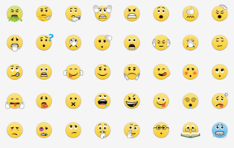
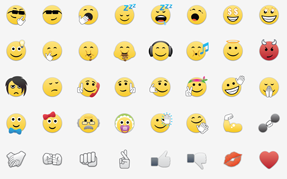
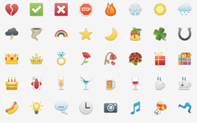
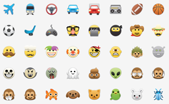

Blackberry Messenger (BBM)
===

- [Official Help](http://help.bbm.com/en/support/solutions/articles/19000060707-emoticons-available-in-bbm)
- [Inofficial outdated overview at Imgur](https://imgur.com/GPY8AYT "2013-12-07")
- [Official blog post about BBM 2.0](http://blogs.blackberry.com/2014/02/bbm-emoticons/) [(with high-res picture showing semi-official names and numbers)](https://rimblogs.files.wordpress.com/2014/02/periodictable_bbm.png "2014-02-13, BBM 2.0")

Missing from [`10.5/`](10.5/) compared to Imgur: penguin, umbrella `(um)`, phone `(t)`, sheep `(bah)`, pig, envelope, money `(mo)`, pizza `(pi)`, film strip `(~)`, splat, blank, _bonus_

