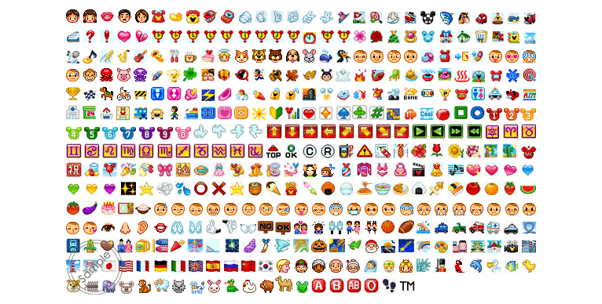
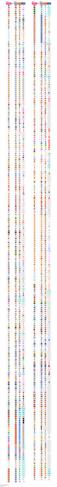

# Disney Mobile (ディズニー・モバイル) #

also see [SoftBank](../softbank/)

SoftBank discontinued its _Disney Mobile_ brand in November 2017. 
Some emojis use the default SoftBank style, but many have been altered to fit the Disney themed.

- <http://www.disney.co.jp/mobile/s/service/3g/3g_pre/disney_pict.html>
- [http://disneymobile.jp/mail/disney_pict](http://web.archive.org/web/20101121221403/http://disneymobile.jp:80/mail/disney_pict)

## [f-03f](f-03f/)

- acquired directly from a Fujitsu DM F-03F phone (released in December 2013) by [@vXBaKeRXv](https://github.com/vXBaKeRXv)
- 565 GIF files, emojis that should be animated have two files for them
- 24 * 24 pixels
- file names: 4-hexdigit lowercase Unicode PUA code E001..E537 in
  * `emoji_sbm_{code}.gif`
  * `emoji_sbm_{code}_bs.gif` (animated?)
  * `new_emoji_sbm_{code}.gif`
