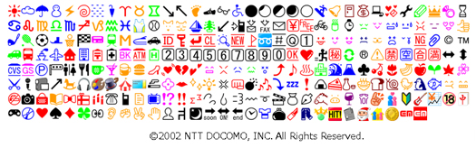

# E-Mobile, eMobile (イー・モバイル) #

also see [Y! Mobile](../y-mobile/) and also [SoftBank](../softbank/)

- <http://developer.emnet.ne.jp/browser.html>
- [http://emobile.jp/service/emnetmail.html](https://web.archive.org/web/20140721185221/http://emobile.jp:80/service/emnetmail.html)
- [http://emobile.jp/service/pdf/mail_change_201206.pdf](https://web.archive.org/web/20140629003202/http://emobile.jp/service/pdf/mail_change_201206.pdf)
- [http://emobile.jp/service/pdf/mail_change_201109.pdf](https://web.archive.org/web/20140629065651/http://emobile.jp/service/pdf/mail_change_201109.pdf)

## [PNG](png/) ##

- Source: extracted from Softbank 2009 conversion PDF
- 200 graphics
- incomplete!

- emobile EMnet v1.7.1 apk

