# EZweb, EZmail #

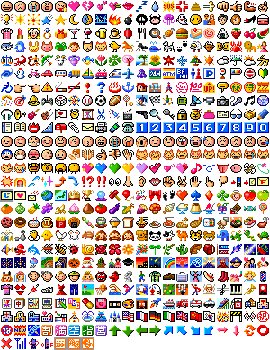

also see [KDDI au](../kddi-au/)

## Evolution

- <http://cgi.wap2.jp/emoji/ezweb/color_ico2.html> before 2002: [1..330](color_ico2.gif), [331..334, 500..518](color_ico_wap2_plus.gif), some without 305..334 and 500..518
- <http://cgi.wap2.jp/emoji/ezweb/color_ico_renew.html> 2002: [1..518, 700..828](color_renew.gif)
- <http://cgi.wap2.jp/emoji/ezweb/?act=new_pict> after 2002: [Openwave](../openwave/) 519..567 and 568..589

## Device support ##

* Devices only supporting 1..304
	C4xx series, C1001SA, 
	Tx1x series (excluding TK 11), TK 23
* Devices supporting 1..330
	C4xx series, C1001SA, 
	Tx1x series (TK11), Tx2x series, Tx3x series;
	C30xx series, C10xx series, 
	A3011SA, A3012CA, A3013T, A3014S
* Devices supporting 1..334 and 500..518
	Tx2x series, Tx3x series (excluding TK 23)
* Devices not supporting 519..589, but 700..828
	W31CA, W32H, 
	W41S, W44S, W47T, 
	W53T, W52S, W53S, W54T
* Devices supporting 519..567, but not 568..589
	W42CA, W43H, 
	W51CA, W51P, W52CA, W52H, W52P, W52SH, W53CA, W53H, W53K, 
	W61CA, W61H, W61T, W61SH, W61P, W62P, W62SH, W62SA, W63SA, W64SH, W65T, 
	SH001, S003, S004, S006, CA006, K007, K012, 
	Premier3, PLY, X-RAY, URBANO AFFARE
* Devices supporting 519..589:
	W54SA, W56T, 
	W61SA, W61S, W62CA, W62H, Re (W63S), W63H, W63CA, W63SA, W64SA, 
	CA003, CA005, 
	G'zOne Type-X, beskey, F001, H001, 
	K002, K011, 
	S001, S006, SA001, 
	SH001, SH002, SH003, SH004, SH006, SH007, SH009, SH010, SH011, 
	T001, T002, T003, T004, T008, 
	U1, G9

## Overview images ##

### A, 175 monochrome emojis

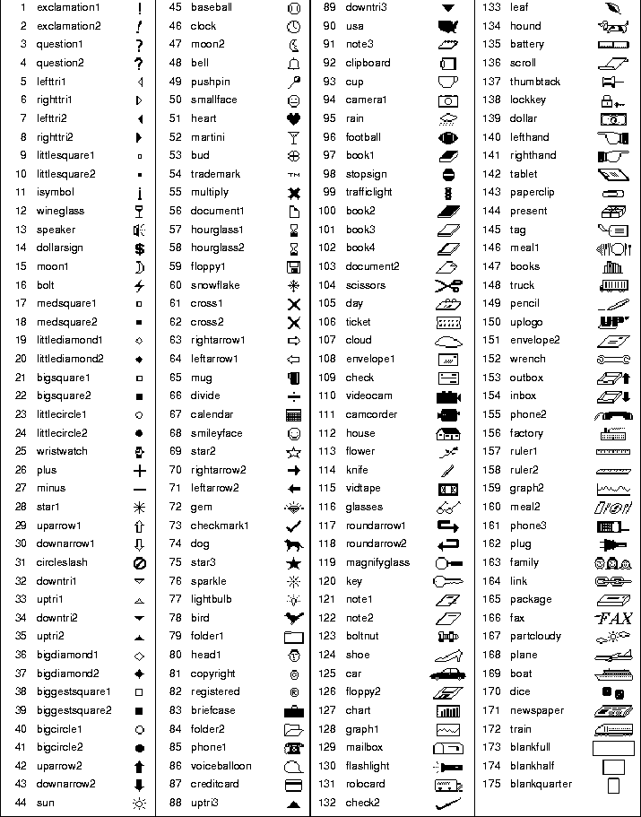

### B, 175 colorful emojis

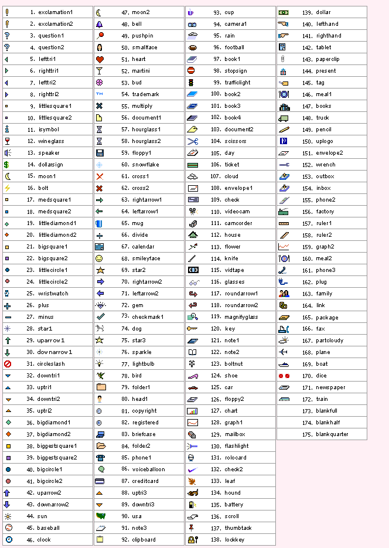

### C, 330 standard emojis plus WAP extension

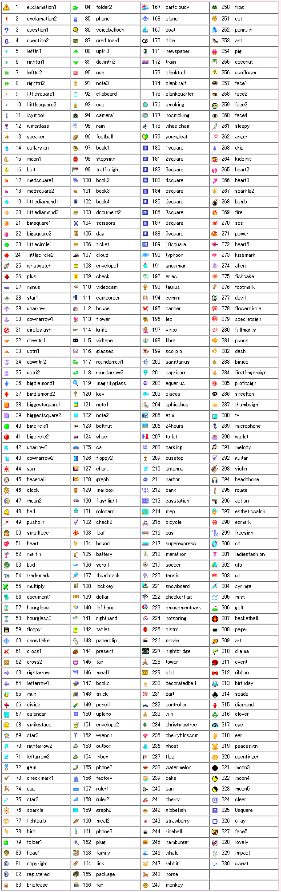
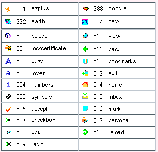

### D, 500ish emojis

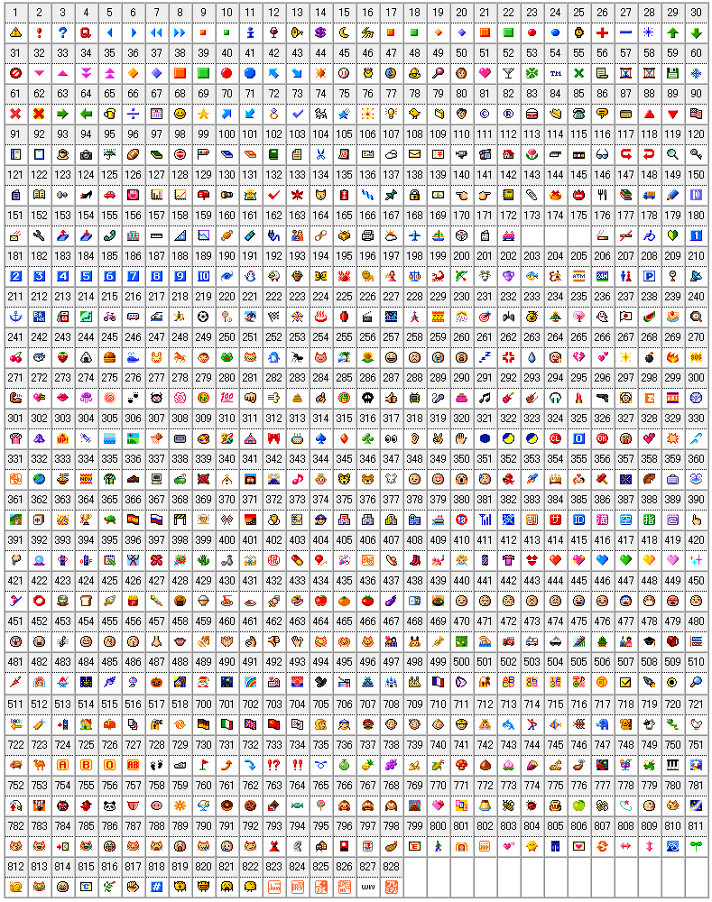

## All four sets in parallel columns: A, B, C, D

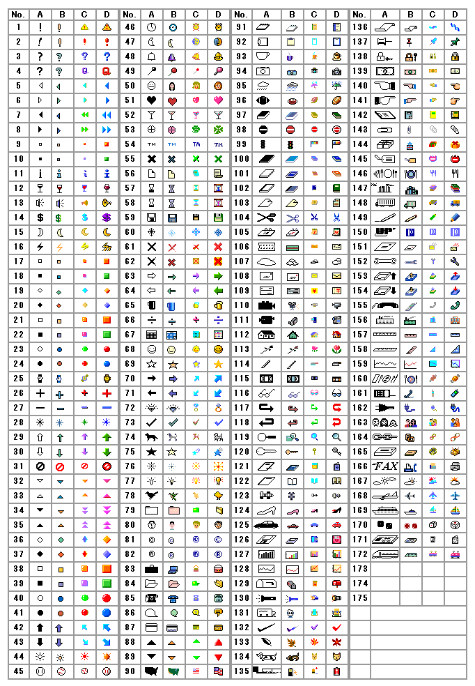
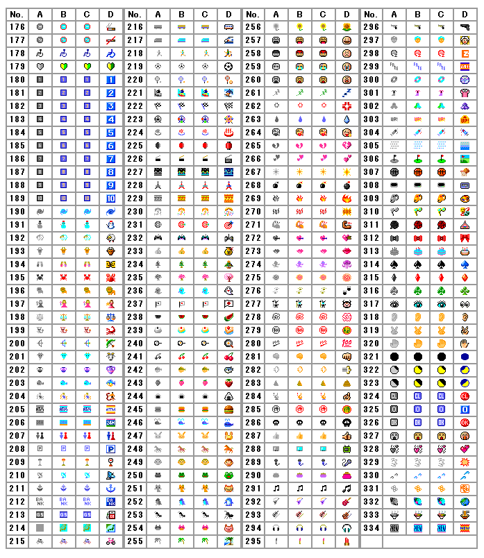
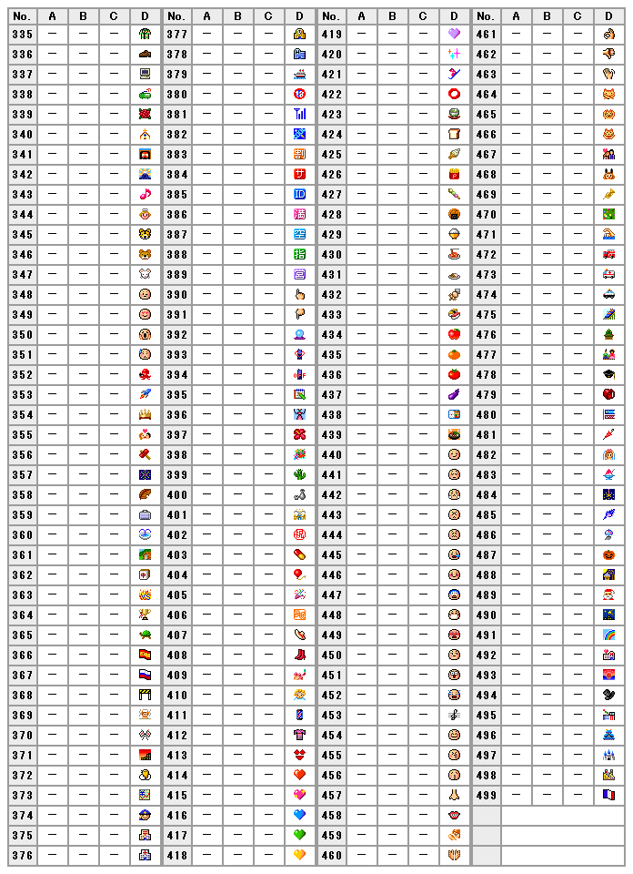
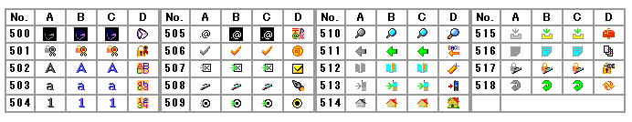
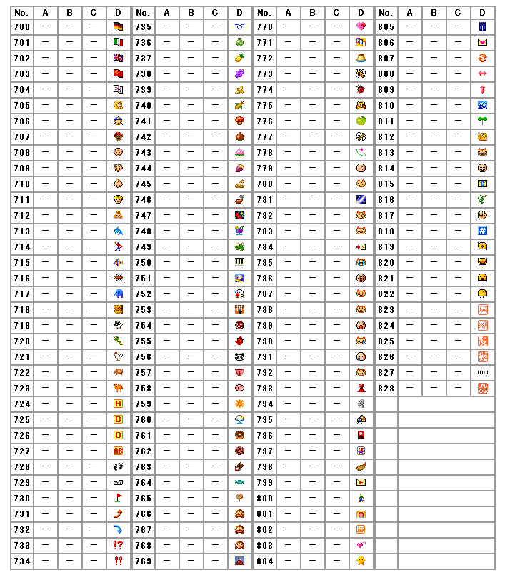
