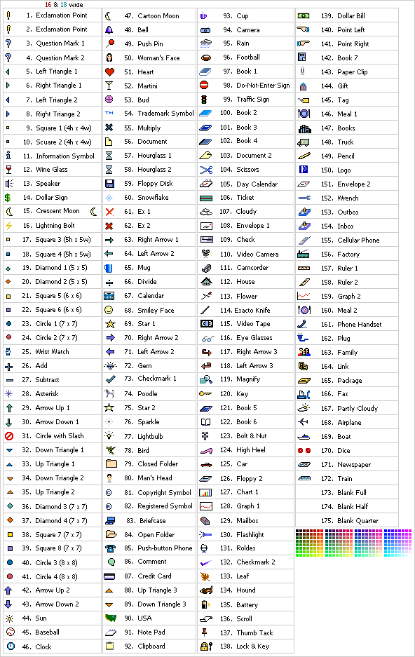

# EZweb, EZmail #

also see [KDDI au](../kddi-au/)

## Evolution

### A, 175 monochrome emojis

### B, 175 colorful emojis

### C, 330 standard emojis plus WAP extension

### D, 500ish emojis

## All four sets in parallel columns: A, B, C, D

