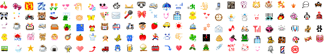

# NTT Docomo (NTTドコモ), i-mode (iモード, アイモード) #

- [original i-mode emojis](https://www.nttdocomo.co.jp/service/developer/make/content/pictograph/basic/index.html): `https://www.nttdocomo.co.jp/service/developer/make/content/pictograph/basic/images/{3 decimal digits < 207 or 177}.gif`
- [later extensions](https://www.nttdocomo.co.jp/service/developer/make/content/pictograph/extention/index.html): `https://www.nttdocomo.co.jp/service/developer/make/content/pictograph/extention/images/{3 decimal digits < 77}.gif`

- https://www.nttdocomo.co.jp/binary/pdf/service/imode_mail/function/emoji_convert/pictogram.pdf 2012-04 Correspondence to KDDI au, E-Mobile, SoftBank, Disney Mobile, iPhone

Shift-JIS codes: hexadecimal F890..F9FF (with empty spaces).
Basic (#1..176) F89F..F8FC, F940..F9B0 with interruptions (U+E63E..E6BA), 
hidden (#177..206) F94A..F94F, F953..F954, F958..F95A, F95F..F971 (U+E6A6..E6CD), 
extended (#x1..x76) F9B1..F9FC (U+E70C..E757).

## [AI](ai/) ##

- Adobe Illustrator glyphs (vector files)
- Source: 
- Date: 
- File names: four decimal digits

## [SVG](svg/) ##

- vector files generated from AI sources

## [PNG](png/) ##

- bitmap files generated from AI sources

## [i](i/) ##

- Source: J-Phone epad
- Original folder name: `i` 
- used by Docomo and Willcom 
- 282 graphics
- File names: hexadecimal 4-digit numbers `F89F`..`F9FC` which are the ShiftJIS codes
- Date: 2002

### [GIF](i/gif/) ###

- original files

### [PNG](i/png/) ###

- generated from the original GIF files above

### [i](i/i/) ###

- alternative to GIF above
- Source: [Mobile emoticon support BBS (SmallPICT)](http://wap2.jp/download/spict/index.html)
- GIF
- 283 graphics
- File names: 4 hexadecimal digits `F89F`..`F9FC`

# Decomail #

