

[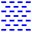](../0007.ai)
[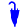](../0008.ai)

[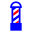](../0102.ai)

[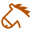](../0139.ai)

[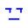](../0182.ai)

[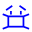](../0190.ai)

[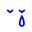](../0200.ai)

[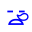](../0209.ai)

[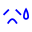](../0212.ai)

[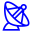](../0363.ai)

[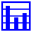](../0388.ai)
[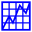](../0389.ai)
[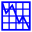](../0390.ai)

[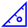](../0395.ai)

[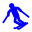](../0429.ai)

[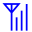](../0527.ai)

[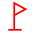](../0622.ai)

[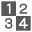](../0714.ai)

