

[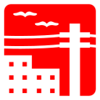](../svg/0012.svg)

[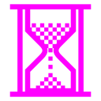](../svg/0028.svg)

[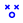](../svg/0180.svg)
[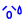](../svg/0181.svg)

[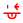](../svg/0185.svg)

[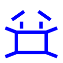](../svg/0190.svg)

[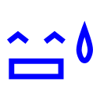](../svg/0193.svg)

[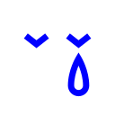](../svg/0200.svg)

[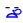](../svg/0209.svg)

[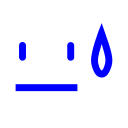](../svg/0211.svg)

[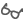](../svg/0264.svg)

[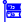](../svg/0342.svg)

[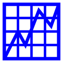](../svg/0389.svg)

[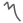](../svg/0499.svg)

[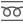](../svg/0515.svg)

[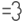](../svg/0681.svg)

