

[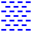](../ai/0007.ai)
[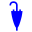](../ai/0008.ai)

[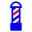](../ai/0102.ai)

[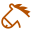](../ai/0139.ai)

[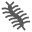](../ai/0152.ai)

[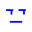](../ai/0182.ai)

[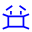](../ai/0190.ai)

[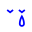](../ai/0200.ai)

[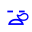](../ai/0209.ai)

[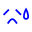](../ai/0212.ai)

[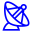](../ai/0363.ai)

[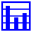](../ai/0388.ai)
[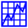](../ai/0389.ai)
[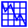](../ai/0390.ai)

[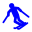](../ai/0429.ai)

[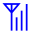](../ai/0527.ai)

[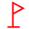](../ai/0622.ai)

[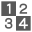](../ai/0714.ai)

