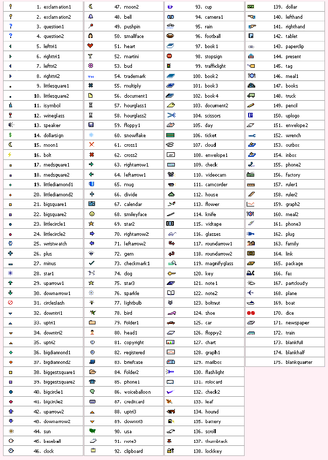
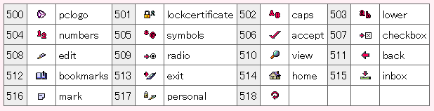
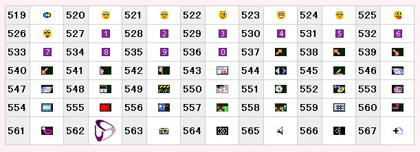

Openwave, WAP
=============

also see [KDDI](../kddi-au/)

- <http://cgi.wap2.jp/emoji/ezweb/color_ico.html>

The Openwave browser supported WAP/WML, HDML and other mobile HTML subsets and alternatives. 
It was used on various phones, but in particular for [KDDI EZweb](../ez-web/).
Some phones came with different graphics than the default Openwave ones, though.

Version history
---------------

- [Openwave Mobile Browser](https://web.archive.org/web/20100128070936/http://developer.openwave.com:80/ja/tools_and_sdk/openwave_mobile_sdk/SDK331/index.html), #1..175
	 <!-- http://cgi.wap2.jp/emoji/ezweb/icoimg/color_ico.gif -->
	Devices V801SH / V801SA etc.
	[http://developer.openwave.com/ja/tools_and_sdk/openwave_mobile_sdk/SDK331/index.html](https://web.archive.org/web/20100128070936/http://developer.openwave.com:80/ja/tools_and_sdk/openwave_mobile_sdk/SDK331/index.html)
- [Openwave Universal Edition 1.0+](https://web.archive.org/web/20100211234104/http://developer.openwave.com:80/ja/tools_and_sdk/openwave_mobile_sdk/SDKUE11/index.html), WAP 2.0, #500..518
	 <!-- http://cgi.wap2.jp/emoji/ezweb/icoimg/openwave_500_518.gif -->
	Devices: C5001T, A1101S, C3000, A3000, A1300, A5300, A5400
	[http://developer.openwave.com:80/documentation/xhtml_mp_css_reference/pictograms.html#651156](https://web-beta.archive.org/web/20090516235144/http://developer.openwave.com:80/documentation/xhtml_mp_css_reference/pictograms.html#651156)
- [Openwave 6.2+](https://web.archive.org/web/20100211224802/http://developer.openwave.com:80/ja/tools_and_sdk/openwave_mobile_sdk/SDK62K/index.html), #519..567
	 <!-- http://cgi.wap2.jp/emoji/ezweb/icoimg/color_ico_62.gif -->
	Devices: W51P etc.
	[http://developer.openwave.com:80/documentation/xhtml_mp_css_reference/icons.html](https://web-beta.archive.org/web/20090515011632/http://developer.openwave.com:80/documentation/xhtml_mp_css_reference/icons.html)

Overview
--------

  

Details
-------

[Openwave Mobile Browser](https://github.com/Crissov/unicode-proposals/issues/280)

- [http://developer.openwave.com/documentation/xhtml_mp_css_reference/icons.html](http://web.archive.org/web/20080515123133/http://developer.openwave.com/documentation/xhtml_mp_css_reference/icons.html#651156)

~~~~ html

~~~~
~~~~ css
body {background-image: localsrc("78")}
ul>li {-list-style-image: localsrc("bird")}
~~~~

Size and style vary by make and model of the phone and version of the browser. The ID numbers basically match [EZweb](../ez-web/) emojis. 

Support: IDs 1–175, 500–536 in Openwave Mobile Browser 6.1+; 537–561 in 6.2+

| ID	| Image	| Emoji	| 
|-----------|-----------|-----------|
| 1	| 	| 	|
| 2	| 	| 	|
| 3	| 	| 	|
| 4	| 	| 	|
| 5	| 	| 	|
| 6	| 	| 	|
| 7	| 	| 	|
| 8	| 	| 	|
| 9	| 	| 	|
| 9	| 	| 	|
| 10	| 	| 	|
| 11	| 	| 	|
| 12	| 	| 	|
| 13	| 	| 	|
| 14	| 	| 	|
| 15	| 	| 	|
| 16	| 	| 	|
| 17	| 	| 	|
| 18	| 	| 	|
| 19	| 	| 	|
| 20	| 	| 	|
| 21	| 	| 	|
| 22	| 	| 	|
| 23	| 	| 	|
| 24	| 	| 	|
| 25	| 	| 	|
| 26	| 	| 	|
| 27	| 	| 	|
| 28	| 	| 	|
| 29	| 	| 	|
| 30	| 	| 	|
| 31	| 	| 	|
| 32	| 	| 	|
| 33	| 	| 	|
| 34	| 	| 	|
| 35	| 	| 	|
| 36	| 	| 	|
| 37	| 	| 	|
| 38	| 	| 	|
| 39	| 	| 	|
| 40	| 	| 	|
| 41	| 	| 	|
| 42	| 	| 	|
| 43	| 	| 	|
| 44	| 	| 	|
| 45	| 	| 	|
| 46	| 	| 	|
| 47	| 	| 	|
| 48	| 	| 	|
| 49	| 	| 	|
| 50	| 	| 	|
| 51	| 	| 	|
| 52	| 	| 	|
| 53	| 	| 	|
| 54	| 	| 	|
| 55	| 	| 	|
| 56	| 	| 	|
| 57	| 	| 	|
| 58	| 	| 	|
| 59	| 	| 	|
| 60	| 	| 	|
| 61	| 	| 	|
| 62	| 	| 	|
| 63	| 	| 	|
| 64	| 	| 	|
| 65	| 	| 	|
| 66	| 	| 	|
| 67	| 	| 	|
| 68	| 	| 	|
| 69	| 	| 	|
| 70	| 	| 	|
| 71	| 	| 	|
| 72	| 	| 	|
| 73	| 	| 	|
| 74	| 	| 	|
| 75	| 	| 	|
| 76	| 	| 	|
| 77	| 	| 	|
| 78	| 	| 	|
| 79	| 	| 	|
| 80	| 	| 	|
| 81	| 	| 	|
| 82	| 	| 	|
| 83	| 	| 	|
| 84	| 	| 	|
| 85	| 	| 	|
| 86	| 	| 	|
| 87	| 	| 	|
| 88	| 	| 	|
| 89	| 	| 	|
| 90	| 	| 	|
| 91	| 	| 	|
| 92	| 	| 	|
| 93	| 	| 	|
| 94	| 	| 	|
| 95	| 	| 	|
| 96	| 	| 	|
| 97	| 	| 	|
| 98	| 	| 	|
| 99	| 	| 	|
| 100	| 	| 	|
| 101	| 	| 	|
| 102	| 	| 	|
| 103	| 	| 	|
| 104	| 	| 	|
| 105	| 	| 	|
| 106	| 	| 	|
| 107	| 	| 	|
| 108	| 	| 	|
| 109	| 	| 	|
| 110	| 	| 	|
| 111	| 	| 	|
| 112	| 	| 	|
| 113	| 	| 	|
| 114	| 	| 	|
| 115	| 	| 	|
| 116	| 	| 	|
| 117	| 	| 	|
| 118	| 	| 	|
| 119	| 	| 	|
| 120	| 	| 	|
| 121	| 	| 	|
| 122	| 	| 	|
| 123	| 	| 	|
| 124	| 	| 	|
| 125	| 	| 	|
| 126	| 	| 	|
| 127	| 	| 	|
| 128	| 	| 	|
| 129	| 	| 	|
| 130	| 	| 	|
| 131	| 	| 	|
| 132	| 	| 	|
| 133	| 	| 	|
| 134	| 	| 	|
| 135	| 	| 	|
| 136	| 	| 	|
| 137	| 	| 	|
| 138	| 	| 	|
| 139	| 	| 	|
| 140	| 	| 	|
| 141	| 	| 	|
| 142	| 	| 	|
| 143	| 	| 	|
| 144	| 	| 	|
| 145	| 	| 	|
| 146	| 	| 	|
| 147	| 	| 	|
| 148	| 	| 	|
| 149	| 	| 	|
| 150	| 	| 	|
| 151	| 	| 	|
| 152	| 	| 	|
| 153	| 	| 	|
| 154	| 	| 	|
| 155	| 	| 	|
| 156	| 	| 	|
| 157	| 	| 	|
| 158	| 	| 	|
| 159	| 	| 	|
| 160	| 	| 	|
| 161	| 	| 	|
| 162	| 	| 	|
| 163	| 	| 	|
| 164	| 	| 	|
| 165	| 	| 	|
| 166	| 	| 	|
| 167	| 	| 	|
| 168	| 	| 	|
| 169	| 	| 	|
| 170	| 	| 	|
| 171	| 	| 	|
| 172	| 	| 	|
| 173	| 	| 	|
| 174	| 	| 	|
| 175	| 	| 	|
| 500	| 	| 	|
| 501	| 	| 	|
| 502	| 	| 	|
| 503	| 	| 	|
| 504	| 	| 	|
| 505	| 	| 	|
| 506	| 	| 	|
| 507	| 	| 	|
| 508	| 	| 	|
| 509	| 	| 	|
| 510	| 	| 	|
| 511	| 	| 	|
| 512	| 	| 	|
| 513	| 	| 	|
| 514	| 	| 	|
| 515	| 	| 	|
| 516	| 	| 	|
| 517	| 	| 	|
| 518	| 	| 	|
| 519	| 	| 	|
| 520	| 	| 	|
| 521	| 	| 	|
| 522	| 	| 	|
| 523	| 	| 	|
| 524	| 	| 	|
| 525	| 	| 	|
| 526	| 	| 	|
| 527	| 	| 	|
| 528	| 	| 	|
| 529	| 	| 	|
| 530	| 	| 	|
| 531	| 	| 	|
| 532	| 	| 	|
| 533	| 	| 	|
| 534	| 	| 	|
| 535	| 	| 	|
| 536	| 	| 	|
| 537	| 	| 	|
| 538	| 	| 	|
| 539	| 	| 	|
| 540	| 	| 	|
| 541	| 	| 	|
| 542	| 	| 	|
| 543	| 	| 	|
| 544	| 	| 	|
| 545	| 	| 	|
| 546	| 	| 	|
| 547	| 	| 	|
| 548	| 	| 	|
| 549	| 	| 	|
| 550	| 	| 	|
| 551	| 	| 	|
| 552	| 	| 	|
| 553	| 	| 	|
| 554	| 	| 	|
| 555	| 	| 	|
| 556	| 	| 	|
| 557	| 	| 	|
| 558	| 	| 	|
| 559	| 	| 	|
| 560	| 	| 	|
| 561	| 	| 	|
