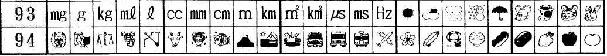
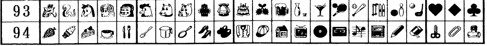
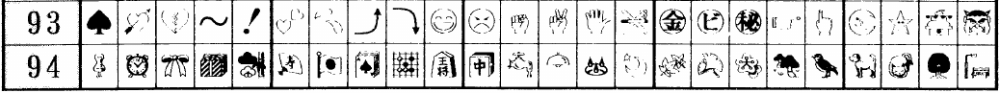
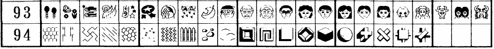

[Sharp](https://github.com/Crissov/unicode-proposals/issues/323)
=====

The Sharp WD-A551 and similar devices assigned pictographs to several empty slots of JIS X0208:1990. This was the base for [J-Phone](../j-phone/) and hence [SoftBank](../softbank/) emojis.

The electronic typewriters WD-A551, made by Sharp from 1991, used some empty rows in [JIS X 0208][JIS0208] to encode bout 160 pictograms that have a striking resemblance of later emojis used on phones.

Emojis
-------

| Cell | Emoji | Category (start)
|------|------------|--------|
| 93/16 | ☀ | Weather
| 93/17 | ⛅ |
| 93/18 | 🌧 |
| 93/19 | ☃ |
| 93/20 | ☂ |
| 93/21 | 🐭 | Animal Heads for Eastern Zodiac
| 93/22 | 🐮 |
| 93/23 | 🐯 |
| 93/24 | 🐰 |
| 93/25 | 🐲 |
| 93/26 | 🐍 |
| 93/27 | 🐴 |
| 93/28 | 🐏/🐑 (head) |
| 93/29 | 🐵 |
| 93/30 | 🐔 (head) |
| 93/31 | 🐶 |
| 93/32 | 🐗 (head) / 🐷 |
| 93/33 |  | Celebration and Drinks
| 93/34 | 🔔 |
| 93/35 | 🎂 |
| 93/36 |  |
| 93/37 | 🍺 |
| 93/38 | 🍶 |
| 93/39 | 🍸 |
| 93/40 | 🎾 | Sports
| 93/41 | ⚾ (with bat #67) |
| 93/42 | 🎿 |
| 93/43 | 🎳 |
| 93/44 | (⛳/🏌) | Golf Ball and Club
| 93/45 | ♥ | Card Suits
| 93/46 | ♦ |
| 93/47 | ♣ |
| 93/48 | ♠ |
| 93/49 | 💘 | Hearts and other Symbols
| 93/50 | 💔 |
| 93/51 | (~) | long tilde
| 93/52 | ❗ / ❕ |
| 93/53 | 💕 |
| 93/54 | 💦 |
| 93/55 | ⤴ |
| 93/56 | ⤵ |
| 93/57 | 😁 | ? Emoticons
| 93/58 | 😠 | ?
| 93/59 | ✊ | Hands
| 93/60 | ✌ |
| 93/61 | ✋ / 🖐 |
| 93/62 | 🚭 | Signs
| 93/63 | 🈴? |
| 93/64 | ? |
| 93/65 | ? |
| 93/66 | 👉 | Pointers
| 93/67 | 👆 |
| 93/68 | 🌜 | Celestial Faces
| 93/69 | ⭐ | star with face?
| 93/70 | ? | ?
| 93/71 | 👹?|
| 93/72 | (🎈🎐?) | Seasonal Holidays
| 93/73 | 🦋+🌼 |
| 93/74 | 🎏 |
| 93/75 | 🍃 / 🍂 |
| 93/76 | 🎐? |
| 93/77 | ? |
| 93/78 | 🎑 |
| 93/79 | ? |
| 93/80 | 🍂? |
| 93/81 | 🎅 | 
| 93/82 | 👴 | People Faces
| 93/83 | 👵 |
| 93/84 | 👨? |
| 93/85 | 👩? |
| 93/86 | 👨/👦? |
| 93/87 | 👩/👧? |
| 93/88 | 👦 |
| 93/89 | 👧 |
| 93/90 | 👶 |
| 93/91 | 🐏 (head) | Western Zodiac
| 93/92 | 🐂 (head)/🐮 |
| 93/93 | 👭? |
| 93/94 | 🦀 |
| 93/95 | 🦁 |
| 94/01 | 🦁 |
| 94/02 | 👰? |
| 94/03 | ⚖ |
| 94/04 | 🦂 |
| 94/05 | 🏹 |
| 94/06 | 🐐 (head) |
| 94/07 | 🏺 |
| 94/08 | 🐟 |
| 94/09 | 🏔/🗻/⛰ | Places
| 94/10 | 🏕/⛺ |
| 94/11 | ? |
| 94/12 | 🚘? | Vehicles
| 94/13 | 🚍? |
| 94/14 | 🚆/🚇/🚊? |
| 94/15 | ✈ |
| 94/16 | 🌸 | Nature
| 94/17 | ? |
| 94/18 | rescue ring? |
| 94/19 | 🍚 | Food & Cooking
| 94/20 | 🍡? |
| 94/21 | ? |
| 94/22 | 🍗? |
| 94/23 | 🍎/🍏 |
| 94/24 | 🍊? |
| 94/25 | 🍇 |
| 94/26 | 🍦 |
| 94/27 | 🍰 |
| 94/28 | ☕ |
| 94/29 | 🍴 |
| 94/30 | 🥄 |
| 94/31 | 🍲? pot, kettle, measuring cup? |
| 94/32 | 🍳 |
| 94/33 | 👠👠 | Clothes
| 94/34 | 👞👞 |
| 94/35 | 👚 / 👕 | 
| 94/36 | baseball cap | Unicode 10
| 94/37 | 🏠 | Household
| 94/38 | 📺 | 
| 94/39 | 💿/📀/ vinyl #71  |
| 94/40 | 📼 |
| 94/41 | 🎼 / 🎶 |
| 94/42 | ? | Office
| 94/43 | ✏ |
| 94/44 | rubber? #288  |
| 94/45 | ✂ |
| 94/46 | 📎 |
| 94/47 | stamp? |
| 94/48 | 📌 | 
| 94/49 | ⏰ Alarm Clock | ?
| 94/50 | 🎀 | Gifts
| 94/51 | 🎁 |
| 94/52 | ? | ?
| 94/53 |  |
| 94/54 | 🇯🇵 / 🎌 | Flags 
| 94/55 | 🎴 / 🃏 ? | Games
| 94/56 | (Go) |
| 94/57 | (Shogi) |
| 94/58 | 🀄 |
| 94/59 | 🚰 | Hotels
| 94/60 | 🛎 |
| 94/61 | ♨ |
| 94/62 | 🌃 |
| 94/63 | 🍁? | Plants
| 94/64 |  |
| 94/65 | 🌺? |
| 94/66 | 🍄? | 
| 94/67 | 🐦 | Animals
| 94/68 | 🐕 |
| 94/69 | ? |
| 94/70 | ? | Furniture
| 94/71 | 🛋 |
| 94/72 |  | Surface Patterns
| 94/73 |  |
| 94/74 |  |
| 94/75 |  |
| 94/76 |  |
| 94/77 |  |
| 94/78 |  |
| 94/79 | fence | Outside
| 94/80 | rocks | 
| 94/81 |  | Geometric Structures
| 94/82 |  |
| 94/83 |  |
| 94/84 |  |
| 94/85 |  |
| 94/86 |  |
| 94/87 |  |
| 94/88 |  |
| 94/89 |  |
| 94/90 |  |
| 94/91 |  |
| 94/92 |  |
| 94/93 |  |
| 94/94 |  |

Specific References
-------------------

- [JIS X 0208-1990][JIS0208]
- [安岡孝 (Koichi Yasuoka)][Yasuoka], source of the 4 pictures above ([blog](https://srad.jp/~yasuoka/journal/495877/))
- [Sharp WD-A521 user manual, pages 457&ndash;458](http://kanji.zinbun.kyoto-u.ac.jp/~yasuoka/Emoji/SHARP-WD-A521p457-458.pdf)

[JIS0208]: https://en.wikipedia.org/wiki/JIS_X_0208#Unassigned_code_points 
[Yasuoka]: http://kanji.zinbun.kyoto-u.ac.jp/~yasuoka/JUGYO/2009-12-21.pdf#page=7 "Collection of early character sets with pictograms in them"
