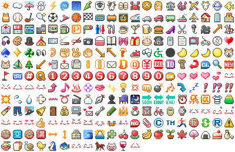

# Six Apart Typepad #

Six Apart still offers a free ([CC-BY-2.1-JP](https://creativecommons.org/licenses/by/2.1/jp/)) set of GIFs for the original emojis to be used to display emails from Japanese mobile phones in webmail applications etc.

## emoticons ##

- Source: <https://www.sixapart.jp/about/emoji.html>
- 252 GIF files, some animated
- File names: English words

## Hatena ##

- Source: <https://github.com/wakaba/hatena-emoji-data>
- 253 GIF files in folder `0FE000`, 1 GIF and 1 PNG file in folder `0FA700`
- File names: `e-{3 uppercase hexadecimal digits}.gif`
